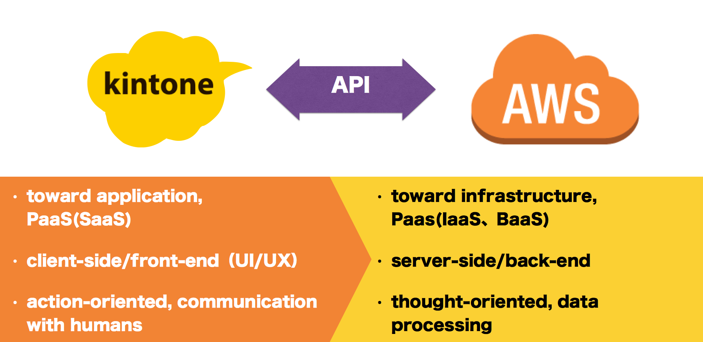
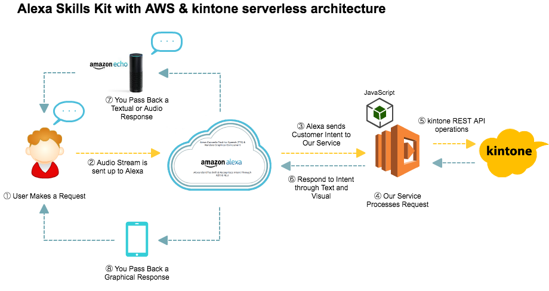

## Alexa Skills Kit with AWS & kintone Serverless Architecture

### What is kintone?
[kintone](https://www.kintone.com/) is Cybozu's no-code application platform making work more productive, efficient, and fun through powerful business applications.
- Build Apps – Build applications quickly and easily.  No coding required.
- Collaborate – Ideas, teams, and projects come together with kintone.
- Automate – Supercharge your business processes using workflow automation.

Additionally, kintone provides REST API and JavaScript API for developers to build custom integrations, access kintone records and create custom views with JavaScript/CSS.

### Connectivity of kintone with AWS
kintone and AWS have excellent connectivity and joint-capabilities.

### Concept of Alexa Skills Kit (ASK) for kintone
Amazon Alexa makes it easy to operate kintone REST APIs via voice-control: register records, add comments, build apps, and much more.

### ASK samples
- Order & Inventory Management
